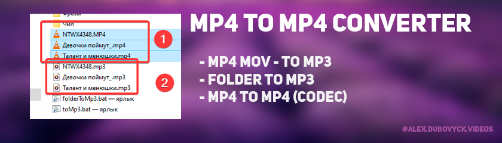
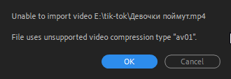

# toMP3



## Описание

Этот проект - это конвертер **видео** файлов в **аудио** (формат mp3)

А так же перекодировщик ***.mp4** файлов в ***.mp4** (но с другим кодеком)

> Это нужно, чтоб можно было импортировать видео в Adobe Premiere Pro без **ошибки кодека av01**

<details>
<summary>av01</summary>


</details>

Из особенностей библиотека `moviepy` - **не** устанавливается глобально в систему! [Пруф](https://youtu.be/gPL59fBfUKs)

А ипользуется виртуальное окружение. 

---

## Установка

- Для работы скриптов `Python` должен быть в системе!

> [python-3.8.7-amd64 Win7](https://www.python.org/ftp/python/3.8.7/python-3.8.7-amd64.exe)
> или
> [python-3.12.0-amd64 Win10](https://www.python.org/ftp/python/3.12.0/python-3.12.0-amd64.exe)

- Создаём и настраиваем `venv`
    - `python -m venv venv`

- Устанавливаем список библиотек из `requirements.txt`
    - `pip install -r requirements.txt`

- Изменяем пути в bat-никах на ваши

> **Батники:**
> folderToMp3.bat
> toMp3.bat
> toMp4.bat

> **Пути в них:**
> cmd /k "cd /d E:\PythonProjects\toMP3\venv\Scripts & activate & cd /d E:\PythonProjects\toMP3 & python folderToMp3Main.py"
> cmd /k "cd /d E:\PythonProjects\toMP3\venv\Scripts & activate & cd /d E:\PythonProjects\toMP3 & python toMp3Main.py"
> cmd /k "cd /d E:\PythonProjects\toMP3\venv\Scripts & activate & cd /d E:\PythonProjects\toMP3 & python toMp4Main.py"

[Видео с установкой](https://youtu.be/UgHJQg2RJAI)

---

## Использование

### MP4 to
- Запускаем `toMp3.bat`
- Перетаскиваем файл в открытую `cmd` (технология Drag'n'Drop)
- Жмём `Enter`


[Конвертер файлов по одному](https://youtu.be/b8Apnfi1H8U)

[Конвертер файлов целой папкой](https://youtu.be/mIWgtYCkux0)

[Решение проблемы с кодировкой av01](https://youtu.be/h28vVPzJsBQ)

---

## Старые скрипты

> Должен стоять **ffmpeg** в PATH

### Audio

```bash
# Any mp4 to mp3
del *.mp3
for %%a in ("*.mp4") do ffmpeg -i "%%a" "%%~na.mp3"

# 1.mp4 to audio.mp3
del *.mp3
ffmpeg -i 1.mp4 audio.mp3
REM pause
```

### Video

```bash
# Any mov\mkv to mp4
del *.mp4
for %%a in ("*.mov") do ffmpeg -i "%%a" "%%~na.mp4"
for %%a in ("*.mkv") do ffmpeg -i "%%a" "%%~na.mp4"

# 1.mov to 1.mp4
del *.mp4
ffmpeg -i 1.mov 1.mp4
REM pause
```

---

# Репо
| Описание | Ссылка |
| ------ | ------ |
Репо: | [github.com/gitalexhubuser/toMp3](https://github.com/gitalexhubuser/toMp3)
